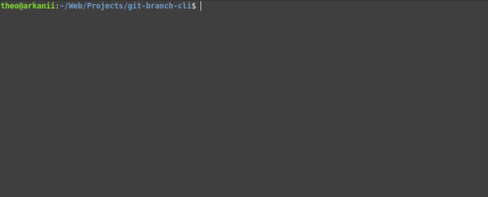

# Git Branch CLI

[](https://www.npmjs.com/package/git-branch-cli)
[](https://www.npmjs.com/package/git-branch-cli)
[](https://github.com/carloscuesta/gitmoji)

> A client for creating git branch easily using interactive questions.



## Features

- Easy to use
- Interactive prompt
- Fully configurable

## Install

### For global use :

```shell
$ yarn global add git-branch-cli
```
Or
```shell
$ npm install -g git-branch-cli
```

### For local use :

```shell
$ yarn add git-branch-cli
```
Or
```shell
$ npm install git-branch-cli
```

Add to `package.json` file :

```json
"scripts": {
  "git-branch": "git-branch"
}
```

## Usage

### If installed globally :

```shell
git-branch
```

### If installed locally :

```shell
yarn run git-branch
```
or

```shell
npm run git-branch
```

---

```
A client for creating git branch easily using interactive questions.
	
  Usage
    $ git-branch
    
  Options
    --init, -i        Initialize a new branch
    --version, -v     Print git-branch-cli installed version
```

## Configuration

The configuration for using git-branch-cli should be located in the `package.json` file.

Example :

```json
"git-branch-cli": [
    {
        "name": "type",
        "message": "What type is your branch ?",
        "type": "autocomplete",
        "choices": [
            "feature",
            "bug"
        ],
        "characterAfter": "/"
    },
    {
        "name": "name",
        "message": "What is the name of the feature ?",
        "characterAfter": "-"
    },
    {
        "name": "ticket",
        "message": "What is the ticket number ?",
        "type": "number"
    }
]
```

#### name (required)

Type: `string`

Only for understanding the configuration

#### message (required)

Type: `string`

The question that will be displayed

##### type

Type: `string`

Type of the answer.

Defaults: `input` - Possible values: `input`, `number`, `autocomplete`.

##### choices (required if `type` field is `autocomplete`)

Type: `array`

The different choices for the user

#### characterAfter

Type: `char`

The character that will be positioned after the user's slugified answer


## Credits

Created by Théo Frison, inspired and taken for some parts from [this project](https://github.com/carloscuesta/gitmoji-cli).
